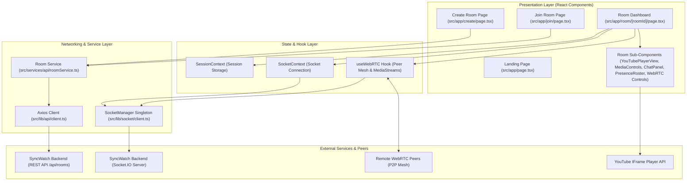

# SyncWatch Frontend

A production-grade, highly performant web application for **realtime synchronized watch parties**. SyncWatch enables users to create or join watch rooms, synchronize YouTube media playback across all participants with frame-level precision, engage in live text chat, send floating emoji reactions, establish WebRTC peer-to-peer audio/video streaming, announce local file offers, and seamlessly recover sessions upon network disconnects.

Built with **Next.js 15 (App Router)**, **TypeScript**, **Tailwind CSS v4**, **Axios**, **Socket.IO Client**, and **WebRTC (RTCDataChannel/RTCPeerConnection signaling)**.

---

## Table of Contents

1. [Architecture Overview & Technology Stack](#1-architecture-overview--technology-stack)
2. [Dependency Map & Forensic Rationale](#2-dependency-map--forensic-rationale)
3. [Next.js App Router & Server/Client Boundary](#3-nextjs-app-router--serverclient-boundary)
4. [TypeScript & Contract Safety Layer](#4-typescript--contract-safety-layer)
5. [Project Structure](#5-project-structure)
6. [Core Architecture & System Topology](#6-core-architecture--system-topology)
7. [End-to-End Data Flow Analysis](#7-end-to-end-data-flow-analysis)
8. [Session Architecture](#8-session-architecture)
9. [Socket.IO Realtime Engine](#9-socketio-realtime-engine)
10. [Socket.IO Event Reference](#10-socketio-event-reference)
11. [REST API Service Layer](#11-rest-api-service-layer)
12. [Backend Authority Model](#12-backend-authority-model)
13. [Room Page Component Architecture](#13-room-page-component-architecture)
14. [YouTube Media Synchronization Deep Dive](#14-youtube-media-synchronization-deep-dive)
15. [Live Room Chat Architecture](#15-live-room-chat-architecture)
16. [Reaction Overlay System](#16-reaction-overlay-system)
17. [WebRTC Mesh & Peer Signaling Deep Dive](#17-webrtc-mesh--peer-signaling-deep-dive)
18. [Transport Disconnect & Session Reconnection Architecture](#18-transport-disconnect--session-reconnection-architecture)
19. [Error Handling & Error Normalization Matrix](#19-error-handling--error-normalization-matrix)
20. [Accessibility Audit](#20-accessibility-audit)
21. [Responsive Design Strategy](#21-responsive-design-strategy)
22. [Performance & Memory Optimization](#22-performance--memory-optimization)
23. [Security & Privacy Boundaries](#23-security--privacy-boundaries)
24. [Edge-Case & Failure Mode Matrix](#24-edge-case--failure-mode-matrix)
25. [Why This Architecture?](#25-why-this-architecture)
26. [Developer Guide: Adding a New Feature](#26-developer-guide-adding-a-new-feature)
27. [Developer Guide: Debugging Workflows](#27-developer-guide-debugging-workflows)
28. [Local Development & Build Setup](#28-local-development--build-setup)
29. [Testing Strategy](#29-testing-strategy)
30. [Development Phase History (F1 - F10)](#30-development-phase-history-f1---f10)
31. [Known Codebase Limitations](#31-known-codebase-limitations)

---

## 1. Architecture Overview & Technology Stack

| Technology | Version | Purpose in SyncWatch | Implementation Rationale |
| :--- | :--- | :--- | :--- |
| **Next.js** | `^15.2.0` | React framework with App Router, SSR foundation, route segments, and custom error boundaries. | Provides fast initial page loads, structured file-based routing (`/`, `/create`, `/join`, `/room/[roomId]`), and standardized boundary fallback handling (`error.tsx`, `global-error.tsx`, `not-found.tsx`). |
| **React** | `^19.0.0` | Declarative UI library with concurrent rendering, hooks, and context. | Manages complex interactive room state, video player integration, chat history updates, and WebRTC stream rendering. |
| **TypeScript** | `^5.7.3` | Type system enforcing compile-time safety and API/Socket contracts. | Eliminates runtime payload mismatches between frontend and backend contracts defined in [`src/types/api.ts`](file:///c:/Users/divya/Desktop/PP/sync-watch/syncwatch-frontend/src/types/api.ts) and [`src/types/socket.ts`](file:///c:/Users/divya/Desktop/PP/sync-watch/syncwatch-frontend/src/types/socket.ts). |
| **Tailwind CSS** | `^4.0.7` | Utility-first CSS engine with `@import "tailwindcss"` in PostCSS environment. | Provides modern dark-mode aesthetics (`bg-slate-950`), responsive flex/grid layouts, micro-animations, and minimal bundle footprint. |
| **Axios** | `^1.7.9` | Promise-based HTTP client for REST endpoints. | Offers clean interceptor points, centralized base configuration, timeout enforcement (10s), and predictable error structures via [`src/lib/api/client.ts`](file:///c:/Users/divya/Desktop/PP/sync-watch/syncwatch-frontend/src/lib/api/client.ts). |
| **Socket.IO Client**| `^4.8.1` | Event-based bidirectional realtime communication library. | Enables real-time media synchronization, room presence broadcasts, live chat streaming, reaction overlays, and WebRTC peer signaling. |
| **react-youtube** | `^10.1.0` | Declarative React wrapper around the YouTube IFrame Player API. | Grants programmatic control over YouTube playback state, seeking, rate adjustments, and time tracking within [`src/components/room/YouTubePlayerView.tsx`](file:///c:/Users/divya/Desktop/PP/sync-watch/syncwatch-frontend/src/components/room/YouTubePlayerView.tsx). |
| **Lucide React** | `^0.475.0` | Icon set for UI actions, indicators, and status displays. | Provides lightweight vector icons (play, pause, mic, video, user, wifi, gauge, etc.) across layout and room components. |
| **clsx** & **tailwind-merge** | `^2.1.1` / `^3.0.1` | Conditional class merging utility. | Exports [`cn()`](file:///c:/Users/divya/Desktop/PP/sync-watch/syncwatch-frontend/src/utils/cn.ts) in [`src/utils/cn.ts`](file:///c:/Users/divya/Desktop/PP/sync-watch/syncwatch-frontend/src/utils/cn.ts) to safely combine Tailwind CSS classes without conflict. |

---

## 2. Dependency Map & Forensic Rationale

```
package.json Dependencies
 ├── next (15.2.0)
 │    ├── Used in: src/app/* (App Router, Layout, Error Boundaries)
 │    └── Rationale: Fast server rendering, routing, page segment boundaries. Removing breaks the application framework.
 ├── react & react-dom (19.0.0)
 │    ├── Used in: All components, hooks, contexts
 │    └── Rationale: UI runtime, hooks (`useRef`, `useState`, `useEffect`, `useCallback`, `use`), context API.
 ├── axios (1.7.9)
 │    ├── Used in: src/lib/api/client.ts, src/services/api/roomService.ts
 │    └── Rationale: Centrally configured REST client (`apiClient`) with normalized error handling (`normalizeApiError`).
 ├── socket.io-client (4.8.1)
 │    ├── Used in: src/lib/socket/client.ts, src/contexts/SocketContext.tsx
 │    └── Rationale: Realtime websocket connection manager (`SocketManager`) with automatic reconnect and event acknowledgments (ACKs).
 ├── react-youtube (10.1.0)
 │    ├── Used in: src/components/room/YouTubePlayerView.tsx
 │    └── Rationale: Controls embedded iframe player state, emits local play/pause events, applies server-authoritative media state.
 ├── lucide-react (0.475.0)
 │    ├── Used in: src/components/**/*
 │    └── Rationale: Accessible, styled icons for controls, user roles, network states, and reactions.
 └── clsx & tailwind-merge (2.1.1 / 3.0.1)
      ├── Used in: src/utils/cn.ts, src/components/ui/*
      └── Rationale: Solves class specificity collisions in reusable UI primitives (`Button`, `Card`, `Badge`).
```

---

## 3. Next.js App Router & Server/Client Boundary

SyncWatch utilizes Next.js 15 App Router architecture located under [`src/app/`](file:///c:/Users/divya/Desktop/PP/sync-watch/syncwatch-frontend/src/app).

### Route Segments
- **`/` ([`src/app/page.tsx`](file:///c:/Users/divya/Desktop/PP/sync-watch/syncwatch-frontend/src/app/page.tsx))**: Landing page with hero banner, product feature preview, and CTA entry points to create or join a room.
- **`/create` ([`src/app/create/page.tsx`](file:///c:/Users/divya/Desktop/PP/sync-watch/syncwatch-frontend/src/app/create/page.tsx))**: Client component for room creation. Calls REST API `POST /api/rooms`, initializes local session, and redirects to room.
- **`/join` ([`src/app/join/page.tsx`](file:///c:/Users/divya/Desktop/PP/sync-watch/syncwatch-frontend/src/app/join/page.tsx))**: Client component for joining existing rooms. Verifies room existence via REST API `GET /api/rooms/:roomId`, sets session, and routes to room.
- **`/room/[roomId]` ([`src/app/room/[roomId]/page.tsx`](file:///c:/Users/divya/Desktop/PP/sync-watch/syncwatch-frontend/src/app/room/%5BroomId%5D/page.tsx))**: Interactive watch room dashboard. Binds Socket.IO connection, registers broadcast listeners, handles WebRTC peer connections, YouTube player controls, chat, reactions, and roster presence.

### Server vs. Client Boundary Strategy
- **Root Layout ([`src/app/layout.tsx`](file:///c:/Users/divya/Desktop/PP/sync-watch/syncwatch-frontend/src/app/layout.tsx))**: Server component wrapping the app tree with global CSS ([`globals.css`](file:///c:/Users/divya/Desktop/PP/sync-watch/syncwatch-frontend/src/app/globals.css)), metadata tags, and client context providers (`SessionProvider`, `SocketProvider`, `AppShell`).
- **Interactive Pages (`"use client"`)**: Since watch party features require realtime browser APIs (`sessionStorage`, `WebSocket`, `RTCPeerConnection`, `getUserMedia`, `window` events), interactive page routes explicitly declare `"use client"` at top.
- **Error Boundaries**:
  - [`src/app/error.tsx`](file:///c:/Users/divya/Desktop/PP/sync-watch/syncwatch-frontend/src/app/error.tsx): Page-level error boundary capturing rendering or lifecycle runtime errors. Offers "Try Again" reset or home navigation.
  - [`src/app/global-error.tsx`](file:///c:/Users/divya/Desktop/PP/sync-watch/syncwatch-frontend/src/app/global-error.tsx): Root HTML error boundary catching fatal unhandled root layout exceptions.
  - [`src/app/not-found.tsx`](file:///c:/Users/divya/Desktop/PP/sync-watch/syncwatch-frontend/src/app/not-found.tsx): 404 fallback page rendering formatted help options when routes or room links do not exist.

---

## 4. TypeScript & Contract Safety Layer

SyncWatch strictly configures TypeScript with `strict: true` and path alias `@/*` mapping to `./src/*` in [`tsconfig.json`](file:///c:/Users/divya/Desktop/PP/sync-watch/syncwatch-frontend/tsconfig.json).

### Type Organization
- [`src/types/api.ts`](file:///c:/Users/divya/Desktop/PP/sync-watch/syncwatch-frontend/src/types/api.ts): Contains REST request/response data models (`ApiSuccessResponse`, `ApiErrorResponse`, `RoomUser`, `PublicRoomState`, `MediaState`, `ChatMessage`, `ReactionEvent`, `WebRTCReadyPeer`, `WebRTCFileMetadata`).
- [`src/types/session.ts`](file:///c:/Users/divya/Desktop/PP/sync-watch/syncwatch-frontend/src/types/session.ts): Defines `ActiveSession` state model (`roomId`, `displayName`, `userId`, `reconnectToken`, `role`, `joinedAt`) and `SessionContextType`.
- [`src/types/socket.ts`](file:///c:/Users/divya/Desktop/PP/sync-watch/syncwatch-frontend/src/types/socket.ts): Defines Socket.IO event payloads (`RoomJoinPayload`, `RoomReconnectPayload`, `MediaSetPayload`, `ChatSendPayload`), ACK wrapper models (`SocketAckSuccess`, `SocketAckError`, `SocketAck`), and WebRTC signaling contracts.
- [`src/types/webrtc.ts`](file:///c:/Users/divya/Desktop/PP/sync-watch/syncwatch-frontend/src/types/webrtc.ts): Represents WebRTC state (`MediaPermissionStatus`, `RemotePeerMedia`, `WebRTCState`).

### Contract Safety Rationale
In a multiplayer realtime environment, invalid socket payloads or missing ACK fields cause desynchronization or client crashes. Strict typing guarantees:
1. Every emitted event matches expected backend contract parameters.
2. Every Socket.IO ACK response is explicitly narrowed via `if (response.success)` checks before accessing data fields.
3. Media state timestamps (`updatedAt`), positions (`position`), and playback rates (`playbackRate`) are typed as `number`, preventing NaN calculations during video synchronization.

---

## 5. Project Structure

```
syncwatch-frontend/
├── .env.example                 # Environment variable templates (NEXT_PUBLIC_API_URL, NEXT_PUBLIC_SOCKET_URL)
├── next.config.ts               # Next.js configuration (reactStrictMode: true)
├── package.json                 # Project dependencies, scripts, metadata
├── postcss.config.mjs           # PostCSS configuration for Tailwind CSS v4 (@tailwindcss/postcss)
├── tsconfig.json                # TypeScript strict configuration & alias paths (@/* -> ./src/*)
└── src/
    ├── app/                     # Next.js App Router Page Segments & Route Handlers
    │   ├── create/
    │   │   └── page.tsx         # Create Room page view
    │   ├── join/
    │   │   └── page.tsx         # Join Room page view
    │   ├── room/
    │   │   └── [roomId]/
    │   │       └── page.tsx     # Watch Room primary dashboard & event coordinator
    │   ├── error.tsx            # Route-level error boundary
    │   ├── global-error.tsx     # Application-level error boundary
    │   ├── globals.css          # Tailwind CSS imports & theme variables
    │   ├── layout.tsx           # Root application shell layout
    │   ├── not-found.tsx        # 404 Route fallback
    │   └── page.tsx             # Landing Home page
    ├── components/              # Modular UI Component Layer
    │   ├── layout/              # App Shell Structural Components
    │   │   ├── AppShell.tsx     # Main page container wrapper
    │   │   ├── Footer.tsx       # Application footer
    │   │   └── Header.tsx       # Top navigation header & global connection status badge
    │   ├── room/                # Feature-Specific Watch Room Components
    │   │   ├── ChatPanel.tsx            # Live room chat panel with message list & send form
    │   │   ├── ConnectionStatus.tsx     # Network disconnect banner & retry controls
    │   │   ├── FileShareWidget.tsx      # WebRTC file offer metadata announcement widget
    │   │   ├── LocalMediaControls.tsx   # Camera & microphone toggle buttons
    │   │   ├── LocalVideoPreview.tsx    # Self camera PiP preview window
    │   │   ├── MediaControls.tsx        # Host media controls (play, pause, seek, speed, URL input)
    │   │   ├── PresenceRoster.tsx       # Room participant list with online status & role badges
    │   │   ├── ReactionBar.tsx          # Interactive emoji reaction selector bar
    │   │   ├── ReactionOverlay.tsx      # Animated floating emoji canvas overlay
    │   │   ├── RemoteMediaGrid.tsx      # WebRTC remote video streams grid
    │   │   ├── RoomHeader.tsx           # Room top toolbar (room code, mode, leave button)
    │   │   ├── WatchSurfacePlaceholder. # Empty media state placeholder graphic
    │   │   └── YouTubePlayerView.tsx    # Controlled YouTube iframe player with sync guards
    │   └── ui/                  # Reusable Design System Primitives
    │       ├── Badge.tsx        # Colored status badges
    │       ├── Button.tsx       # Button primitive with variants & loading spinners
    │       ├── Card.tsx         # Glassmorphism surface container
    │       ├── ErrorMessage.tsx # Formatted error alert container
    │       ├── Input.tsx        # Styled form input element with icons & validation messages
    │       └── Spinner.tsx      # Loading indicator SVG
    ├── contexts/                # React Context Providers for Global Shared State
    │   ├── SessionContext.tsx   # Server-authoritative user session & sessionStorage manager
    │   └── SocketContext.tsx    # Realtime Socket.IO client lifecycle wrapper
    ├── hooks/                   # Custom Stateful Hooks
    │   ├── useSession.ts        # Clean accessor for SessionContext
    │   ├── useSocket.ts         # Clean accessor for SocketContext
    │   └── useWebRTC.ts         # Complete WebRTC mesh lifecycle, signaling, & stream manager
    ├── lib/                     # Low-Level Network Client Implementations
    │   ├── api/
    │   │   └── client.ts        # Centralized Axios instance & error normalizer
    │   └── socket/
    │       └── client.ts        # Singleton SocketManager handling lazy connection & reconnection
    ├── services/                # API Service Abstractions
    │   └── api/
    │       └── roomService.ts   # REST endpoints (createRoom, getRoomInfo, getMediaState)
    ├── types/                   # TypeScript Interfaces & Contract Definitions
    │   ├── api.ts               # REST API models & entity schemas
    │   ├── session.ts           # Session context interfaces
    │   ├── socket.ts            # Socket event payloads & ACK models
    │   └── webrtc.ts            # WebRTC state models
    └── utils/                   # Pure Helper Utilities
        ├── cn.ts                # Classname merger (clsx + tailwind-merge)
        ├── errors.ts            # Error message normalizer & backend error dictionary
        └── youtube.ts           # YouTube URL & Video ID extractor
```

---

## 6. Core Architecture & System Topology



---

## 7. End-to-End Data Flow Analysis

### Flow 1: Create Room
1. User enters Display Name, Room Name, and Room Mode ("youtube" or "local") on `/create`.
2. Form submits to `handleSubmit` in [`src/app/create/page.tsx`](file:///c:/Users/divya/Desktop/PP/sync-watch/syncwatch-frontend/src/app/create/page.tsx). `validateForm()` checks length boundaries.
3. Page invokes `createRoom()` in [`src/services/api/roomService.ts`](file:///c:/Users/divya/Desktop/PP/sync-watch/syncwatch-frontend/src/services/api/roomService.ts).
4. Service calls `apiPost<CreateRoomResponseData>('/rooms', payload)` using [`src/lib/api/client.ts`](file:///c:/Users/divya/Desktop/PP/sync-watch/syncwatch-frontend/src/lib/api/client.ts).
5. Backend returns `ApiSuccessResponse<CreateRoomResponseData>` containing authoritative `room`, `hostUserId`, and `user` (with `reconnectToken` and `role: "host"`).
6. Frontend updates `SessionContext` via `setSession(...)`, persisting data to `sessionStorage`.
7. Router navigates to `/room/[roomId]`.

### Flow 2: Join Room
1. User inputs Room Code (`SYNC-A1B2C`) and Display Name on `/join`.
2. Form validates code format via `ROOM_CODE_REGEX` (`/^SYNC-[A-Z0-9]{5}$/i`).
3. Page executes `getRoomInfo(normalizedCode)` REST request to verify room existence and lock status.
4. Upon successful response, `setSession(...)` saves `roomId` and `displayName` to `SessionContext`.
5. Router navigates to `/room/[roomId]`.

### Flow 3: Enter Room & Socket Binding
1. `RoomPage` ([`src/app/room/[roomId]/page.tsx`](file:///c:/Users/divya/Desktop/PP/sync-watch/syncwatch-frontend/src/app/room/%5BroomId%5D/page.tsx)) mounts and validates that route `roomId` matches active `SessionContext`.
2. Page triggers `connect()` from `useSocket()`, initializing socket connection lazily via `SocketManager`.
3. If `userId` and `reconnectToken` exist in session, `RoomPage` emits `room:reconnect`. Otherwise, it emits `room:join`.
4. Backend executes ACK callback returning `user` details and initial `room` state (including `users`, `media`, and metadata).
5. `RoomPage` updates local states (`roomState`, `presenceUsers`, `mediaState`) and clears initial loading spinner (`setIsInitializing(false)`).
6. Broadcast event listeners are bound (`room:state`, `media:state`, `presence:state`, `chat:history`, `chat:message`, `reaction:event`, WebRTC signaling events).

### Flow 4: Leave Room
1. User clicks "Leave Room" in header.
2. `handleLeaveRoom()` emits `room:leave` to backend socket.
3. Socket ACK callback triggers `clearSession()` (removing `syncwatch_session` from `sessionStorage`) and routes user to `/`.

---

## 8. Session Architecture

Session state management is implemented in [`src/contexts/SessionContext.tsx`](file:///c:/Users/divya/Desktop/PP/sync-watch/syncwatch-frontend/src/contexts/SessionContext.tsx) and consumed via [`src/hooks/useSession.ts`](file:///c:/Users/divya/Desktop/PP/sync-watch/syncwatch-frontend/src/hooks/useSession.ts).

### `ActiveSession` Interface
```typescript
export interface ActiveSession {
  roomId: string;
  displayName: string;
  userId?: string;
  reconnectToken?: string;
  role?: UserRole; // "host" | "member"
  joinedAt?: number;
}
```

### Key Behaviors
1. **Hydration**: Upon mounting on the client, `SessionContext` reads `sessionStorage.getItem('syncwatch_session')`. If a valid session object is found, state is hydrated immediately.
2. **Persistence**: Calling `setSession(newSession)` updates React state and synchronizes with `sessionStorage`.
3. **Session Clearing**: Calling `clearSession()` removes `syncwatch_session` and resets session state to `null`.
4. **Authentication Check**: `isAuthenticated` returns `true` only when `session.roomId` and `session.displayName` are present.
5. **Session Isolation**: Using `sessionStorage` (instead of `localStorage`) guarantees that opening two different room tabs in the same browser maintains independent user sessions without token leakage across rooms.

---

## 9. Socket.IO Realtime Engine

Realtime communication relies on a centralized singleton manager [`SocketManager`](file:///c:/Users/divya/Desktop/PP/sync-watch/syncwatch-frontend/src/lib/socket/client.ts) in [`src/lib/socket/client.ts`](file:///c:/Users/divya/Desktop/PP/sync-watch/syncwatch-frontend/src/lib/socket/client.ts) wrapped by [`src/contexts/SocketContext.tsx`](file:///c:/Users/divya/Desktop/PP/sync-watch/syncwatch-frontend/src/contexts/SocketContext.tsx).

### Connection Lifecycle & Options
```typescript
this.socket = io(url, {
  transports: ["websocket", "polling"],
  autoConnect: false, // Connection is explicit and lazy
  reconnection: true,
  reconnectionAttempts: 5,
  reconnectionDelay: 1000,
  reconnectionDelayMax: 5000,
});
```

### Connection States
`SocketConnectionState`: `"disconnected"` | `"connecting"` | `"reconnecting"` | `"connected"` | `"error"` | `"failed"`

### Single Socket Rationale
Creating multiple independent socket connections per component causes duplicate presence entries, out-of-order media events, and socket connection limit exhaustion. `SocketManager` guarantees that **exactly one Socket.IO connection instance** exists per application instance.

---

## 10. Socket.IO Event Reference

All socket events follow strict backend contracts defined in [`src/types/socket.ts`](file:///c:/Users/divya/Desktop/PP/sync-watch/syncwatch-frontend/src/types/socket.ts).

| Event | Direction | Payload Contract | ACK Response | Purpose | Consuming Component |
| :--- | :--- | :--- | :--- | :--- | :--- |
| `room:join` | Client -> Server | `{ roomId, displayName }` | `SocketAck<RoomJoinAckData>` | Join a room for the first time | `RoomPage` |
| `room:reconnect` | Client -> Server | `{ roomId, userId, reconnectToken }` | `SocketAck<RoomReconnectAckData>` | Re-bind existing session after disconnect | `RoomPage` |
| `room:leave` | Client -> Server | `{}` | `SocketAck<{ left: true }>` | Explicitly leave watch room | `RoomPage` (`RoomHeader`) |
| `room:state` | Server -> Client | `PublicRoomState` | N/A (Broadcast) | Authoritative room state update | `RoomPage` |
| `room:user-joined` | Server -> Client | `{ user: RoomUser }` | N/A (Broadcast) | Announce new user connection | `RoomPage` (`PresenceRoster`) |
| `room:user-left` | Server -> Client | `{ userId: string }` | N/A (Broadcast) | Announce user disconnection | `RoomPage`, `useWebRTC` |
| `presence:state` | Server -> Client | `{ users: PresenceUser[] }` | N/A (Broadcast) | Full presence roster sync | `RoomPage` (`PresenceRoster`) |
| `media:set` | Client -> Server | `{ type: "youtube", mediaId }` | `SocketAck<MediaState>` | Host changes current video ID | `RoomPage` (`MediaControls`) |
| `media:play` | Client -> Server | `{ position: number }` | `SocketAck<MediaState>` | Host resumes playback | `RoomPage` (`YouTubePlayerView`) |
| `media:pause` | Client -> Server | `{ position: number }` | `SocketAck<MediaState>` | Host pauses playback | `RoomPage` (`YouTubePlayerView`) |
| `media:seek` | Client -> Server | `{ position: number }` | `SocketAck<MediaState>` | Host seeks to target position | `RoomPage` (`MediaControls`) |
| `media:rate` | Client -> Server | `{ playbackRate: number }` | `SocketAck<MediaState>` | Host alters playback speed | `RoomPage` (`MediaControls`) |
| `media:clear` | Client -> Server | `{}` | `SocketAck<MediaState>` | Host unloads media | `RoomPage` (`MediaControls`) |
| `media:state` | Server -> Client | `MediaState` | N/A (Broadcast) | Authoritative media state update | `RoomPage` (`YouTubePlayerView`) |
| `chat:send` | Client -> Server | `{ message: string }` | `SocketAck<ChatSendAckData>` | Send text chat message | `RoomPage` (`ChatPanel`) |
| `chat:message` | Server -> Client | `ChatMessage` | N/A (Broadcast) | Broadcast new chat message | `RoomPage` (`ChatPanel`) |
| `chat:history` | Server -> Client | `{ messages: ChatMessage[] }` | N/A (Broadcast) | Deliver room chat history | `RoomPage` (`ChatPanel`) |
| `reaction:send` | Client -> Server | `{ emoji: AllowedEmoji }` | `SocketAck<ReactionSendAckData>` | Send floating emoji reaction | `RoomPage` (`ReactionBar`) |
| `reaction:event` | Server -> Client | `ReactionEvent` | N/A (Broadcast) | Broadcast emoji reaction | `RoomPage` (`ReactionOverlay`) |
| `webrtc:peer-ready` | Client -> Server | `{}` | `SocketAck<WebRTCPeerReadyAckData>` | Announce local WebRTC readiness | `useWebRTC` |
| `webrtc:peer-ready` | Server -> Client | `{ userId, displayName, socketId }` | N/A (Broadcast) | Peer WebRTC ready broadcast | `useWebRTC` |
| `webrtc:offer` | Client -> Server | `{ targetUserId, sdp }` | `SocketAck` | Send SDP Offer to peer | `useWebRTC` |
| `webrtc:offer` | Server -> Client | `WebRTCOfferEvent` | N/A (Relayed) | Receive SDP Offer from peer | `useWebRTC` |
| `webrtc:answer` | Client -> Server | `{ targetUserId, sdp }` | `SocketAck` | Send SDP Answer to peer | `useWebRTC` |
| `webrtc:answer` | Server -> Client | `WebRTCAnswerEvent` | N/A (Relayed) | Receive SDP Answer from peer | `useWebRTC` |
| `webrtc:ice-candidate` | Client -> Server | `{ targetUserId, candidate }` | `SocketAck` | Send ICE candidate to peer | `useWebRTC` |
| `webrtc:ice-candidate` | Server -> Client | `WebRTCICECandidateEvent` | N/A (Relayed) | Receive ICE candidate from peer | `useWebRTC` |
| `webrtc:file-metadata` | Client -> Server | `{ name, size, mimeType, targetUserId? }` | `SocketAck<WebRTCFileMetadataAckData>` | Offer local file metadata | `useWebRTC` (`FileShareWidget`) |
| `webrtc:file-offer` | Server -> Client | `WebRTCFileMetadata` | N/A (Broadcast) | Receive file metadata offer | `useWebRTC` (`FileShareWidget`) |

---

## 11. REST API Service Layer

REST API calls are encapsulated in [`src/services/api/roomService.ts`](file:///c:/Users/divya/Desktop/PP/sync-watch/syncwatch-frontend/src/services/api/roomService.ts) and executed via generic HTTP wrappers (`apiGet`, `apiPost`) in [`src/lib/api/client.ts`](file:///c:/Users/divya/Desktop/PP/sync-watch/syncwatch-frontend/src/lib/api/client.ts).

| Method | Endpoint | Request Payload | Response Model | Purpose | Consumed By |
| :--- | :--- | :--- | :--- | :--- | :--- |
| **POST** | `/api/rooms` | `CreateRoomRequest` | `ApiResponse<CreateRoomResponseData>` | Creates a new room & returns host session | `src/app/create/page.tsx` |
| **GET** | `/api/rooms/:roomId` | None | `ApiResponse<GetRoomInfoResponseData>` | Verifies room existence & locked status | `src/app/join/page.tsx` |
| **GET** | `/api/rooms/:roomId/media` | None | `ApiResponse<GetMediaStateResponseData>` | Fetches current media playback state | `roomService.ts` |

---

## 12. Backend Authority Model

SyncWatch enforces a **server-authoritative model**. The frontend never invents or fabricates room state locally.

### Authoritative Entities
1. **`roomId` & `userId`**: Assigned strictly by the backend upon room creation or join.
2. **`reconnectToken`**: Secret token generated by the server for session re-binding.
3. **`role` ("host" | "member")**: Determined by backend room state. Host privilege delegation is server-controlled.
4. **`mediaState`**: Contains server-maintained `position`, `status`, `playbackRate`, `updatedAt`, and monotonically increasing `version` sequence number.
5. **`ChatMessage.id` & `createdAt`**: Generated on the backend to guarantee consistent chat timeline ordering and message deduplication.

---

## 13. Room Page Component Architecture

```
RoomPage (src/app/room/[roomId]/page.tsx)
 ├── RoomHeader (Sticky toolbar, connection status indicator, leave room button)
 ├── ConnectionStatus (Network error & rehydration status banner)
 ├── Watch Surface Area (Left 2 Columns)
 │    ├── ReactionOverlay (Floating animated emojis canvas)
 │    ├── LocalVideoPreview (Floating self camera preview window)
 │    ├── YouTubePlayerView (Controlled YouTube player iframe) OR WatchSurfacePlaceholder
 │    ├── RemoteMediaGrid (WebRTC remote participant video streams)
 │    ├── MediaControls (Host controls for play, pause, seek, speed, video URL input)
 │    ├── LocalMediaControls (Camera and Microphone toggles)
 │    ├── ReactionBar (Interactive emoji selector buttons)
 │    ├── FileShareWidget (Local file offer announcement widget)
 │    └── Room Info Summary Card (Host name, room mode, lock status)
 └── Sidebar Area (Right 1 Column)
      ├── ChatPanel (Live text chat message history & input form)
      └── PresenceRoster (Connected user roster & status badges)
```

---

## 14. YouTube Media Synchronization Deep Dive

Synchronizing media across multiple web clients over variable network latencies requires precise algorithm guards to prevent recursive playback loops.

### Input Normalization
URL inputs passed to `MediaControls` are processed by `extractYouTubeId()` in [`src/utils/youtube.ts`](file:///c:/Users/divya/Desktop/PP/sync-watch/syncwatch-frontend/src/utils/youtube.ts). Supports raw 11-char IDs (`dQw4w9WgXcQ`), standard watch links (`youtube.com/watch?v=...`), short links (`youtu.be/...`), and embed links (`youtube.com/embed/...`).

### Host Authority & Local Action Interception
Only host users render active media control inputs (`MediaControls.tsx`). When the host plays, pauses, or seeks in [`src/components/room/YouTubePlayerView.tsx`](file:///c:/Users/divya/Desktop/PP/sync-watch/syncwatch-frontend/src/components/room/YouTubePlayerView.tsx), the iframe `onStateChange` listener captures event codes (1 = PLAYING, 2 = PAUSED) and triggers `onLocalPlay` or `onLocalPause`. Members render read-only player controls.

### Remote State Application & Effective Position Calculation
When a `media:state` broadcast is received from the server, `YouTubePlayerView` calculates the **effective playback position** for playing videos:

$$\text{Target Position} = \text{MediaState.position} + \max\left(0, \frac{\text{Date.now}() - \text{MediaState.updatedAt}}{1000}\right) \times \text{MediaState.playbackRate}$$

If the delta between player position and Target Position exceeds 1.5 seconds, `seekTo(targetPosition, true)` is invoked.

### Loop Prevention Architecture
When the frontend programmatically calls `playerRef.current.playVideo()` in response to a server event, the YouTube iframe fires a local `onStateChange` event. Without guards, this would trigger `onLocalPlay()`, emitting another socket event to the server and causing an infinite broadcast loop.

To prevent this, [`src/components/room/YouTubePlayerView.tsx`](file:///c:/Users/divya/Desktop/PP/sync-watch/syncwatch-frontend/src/components/room/YouTubePlayerView.tsx) employs a tri-layer guard mechanism:
1. `lastAppliedVersionRef`: Ignores duplicate broadcasts with the same state `version`.
2. `isRemoteUpdateRef`: Synchronous boolean ref set to `true` while executing programmatic player API calls, causing `handleStateChange` to return immediately.
3. `pendingRemoteTargetRef`: Registers target state with a timestamp. When asynchronous iframe callbacks arrive, `handleStateChange` matches event codes against `pendingRemoteTargetRef` and swallows the event without emitting.

---

## 15. Live Room Chat Architecture

Chat functionality is driven by [`src/components/room/ChatPanel.tsx`](file:///c:/Users/divya/Desktop/PP/sync-watch/syncwatch-frontend/src/components/room/ChatPanel.tsx).

- **Message Transmission**: Submitting text emits `chat:send` with `{ message }`. Socket ACK receives `ChatSendAckData` with server-generated `ChatMessage` (`id`, `createdAt`, `userId`, `displayName`).
- **History Hydration**: On room connection, server broadcasts `chat:history` containing past room messages, which are sorted chronologically (`createdAt`).
- **Deduplication**: Incoming messages are deduplicated using a `Set` on `msg.id` to prevent duplicate renders during reconnections.
- **Auto-Scroll**: React `useEffect` triggers `scrollIntoView({ behavior: "smooth" })` on `messagesEndRef` whenever the message array updates.
- **Validation**: Enforces 500-character max length limits and non-empty input checks.

---

## 16. Reaction Overlay System

- **ReactionBar** ([`src/components/room/ReactionBar.tsx`](file:///c:/Users/divya/Desktop/PP/sync-watch/syncwatch-frontend/src/components/room/ReactionBar.tsx)): Renders 8 permitted emojis (`👍`, `❤️`, `😂`, `😮`, `😢`, `🔥`, `🎉`, `👏`). Clicking an emoji emits `reaction:send`.
- **ReactionOverlay** ([`src/components/room/ReactionOverlay.tsx`](file:///c:/Users/divya/Desktop/PP/sync-watch/syncwatch-frontend/src/components/room/ReactionOverlay.tsx)): Receives `reaction:event` broadcasts and creates floating reaction items with unique `keyId` keys.
- **Animation**: Rendered in an absolute pointer-events-none overlay canvas. Elements use CSS `@keyframes float-up` (animating `transform: translateY(-120px)` and `opacity: 0` over 3 seconds) with pseudo-random horizontal percentage positioning (`15%` to `85%`).
- **Lifecycle Cleanup**: Each reaction registers a 3000ms `setTimeout` timer to purge expired reactions from state, avoiding memory leaks.

---

## 17. WebRTC Mesh & Peer Signaling Deep Dive

WebRTC functionality is implemented in [`src/hooks/useWebRTC.ts`](file:///c:/Users/divya/Desktop/PP/sync-watch/syncwatch-frontend/src/hooks/useWebRTC.ts).

### Signaling Topology via Socket.IO
```
Peer A (Offerer)                   Socket.IO Server                   Peer B (Answerer)
   |                                     |                                   |
   |--- emit("webrtc:peer-ready") ------>|                                   |
   |                                     |--- broadcast("webrtc:peer-ready")->|
   |                                     |                                   |
   |-- createOffer() & setLocalDesc()    |                                   |
   |--- emit("webrtc:offer", sdp) ------>|                                   |
   |                                     |--- relay("webrtc:offer", sdp)---->|
   |                                     |                                   |-- setRemoteDesc(offer)
   |                                     |                                   |-- createAnswer() & setLocalDesc()
   |                                     |<-- emit("webrtc:answer", sdp)-----|
   |<-- relay("webrtc:answer", sdp)------|                                   |
   |-- setRemoteDesc(answer)             |                                   |
   |                                     |                                   |
   |--- ICE candidate ------------------>|--- ICE candidate ---------------->|
   |<-- ICE candidate -------------------|<-- ICE candidate -----------------|
   |                                     |                                   |
   |==================== Direct P2P Media / Data Stream =====================|
```

### Key Technical Mechanisms
1. **STUN Configuration**: Uses Google public STUN servers (`stun:stun.l.google.com:19302`, `stun:stun1.l.google.com:19302`).
2. **Pending ICE Candidate Queue**: `pendingCandidatesRef` queues ICE candidates received prior to `setRemoteDescription()`, preventing candidate drop errors.
3. **Local Media Permission Handling**: `toggleLocalMedia(video, audio)` calls `navigator.mediaDevices.getUserMedia()`. DOMExceptions are mapped to clear messages (e.g. `NotAllowedError` -> "Camera/microphone access was denied").
4. **Local & Remote Stream Rendering**: Tracks attached to `RTCPeerConnection` are collected in `remoteStreamsRef` and rendered via HTML `<video>` elements in [`LocalVideoPreview.tsx`](file:///c:/Users/divya/Desktop/PP/sync-watch/syncwatch-frontend/src/components/room/LocalVideoPreview.tsx) and [`RemoteMediaGrid.tsx`](file:///c:/Users/divya/Desktop/PP/sync-watch/syncwatch-frontend/src/components/room/RemoteMediaGrid.tsx).
5. **File Offer Metadata Signaling**: `shareFileMetadata()` emits `webrtc:file-metadata` to announce file metadata (`name`, `size`, `mimeType`, `fileId`). Recipient peers render announcements in [`src/components/room/FileShareWidget.tsx`](file:///c:/Users/divya/Desktop/PP/sync-watch/syncwatch-frontend/src/components/room/FileShareWidget.tsx). *(Note: Binary file byte transfer over RTCDataChannel is currently an un-implemented backend capability; metadata signaling is fully functional).*

---

## 18. Transport Disconnect & Session Reconnection Architecture

Network drops, Wi-Fi switching, or transient server restarts are handled gracefully by Phase F8 Reconnection Architecture.

```mermaid
stateDiagram-v2
    [*] --> Connected: Initial room:join / room:reconnect ACK
    Connected --> Disconnected: Socket disconnect event
    Disconnected --> Reconnecting: Socket.IO transport retry (1s - 5s)
    Reconnecting --> Re-binding: Transport re-connected
    Re-binding --> Connected: room:reconnect ACK success (State rehydrated)
    Re-binding --> SessionExpired: room:reconnect ACK error (SESSION_EXPIRED / ROOM_NOT_FOUND)
    SessionExpired --> [*]: Clear session & display Error Screen
```

### Recovery Steps
1. Socket transport drops. `SocketManager` updates `connectionState` to `"reconnecting"`.
2. [`src/components/room/ConnectionStatus.tsx`](file:///c:/Users/divya/Desktop/PP/sync-watch/syncwatch-frontend/src/components/room/ConnectionStatus.tsx) displays an active amber reconnecting banner.
3. Socket transport re-establishes `connect` event.
4. `RoomPage` automatically emits `room:reconnect` with `{ roomId, userId, reconnectToken }`.
5. On success: Server returns current `room` state. `RoomPage` updates presence, media position, and chat. `useWebRTC` re-announces `webrtc:peer-ready` to re-establish P2P video streams.
6. On invalid token / expired session: `SessionContext` is cleared, and an explicit error card prompts user to rejoin or create a new room.

---

## 19. Error Handling & Error Normalization Matrix

Error handling is centralized in [`src/utils/errors.ts`](file:///c:/Users/divya/Desktop/PP/sync-watch/syncwatch-frontend/src/utils/errors.ts) via `formatErrorMessage()`.

### Backend Error Code Mapping Table

| Backend Error Code | User-Facing Message | Trigger Scenario |
| :--- | :--- | :--- |
| `INVALID_ROOM_CODE` | "Room code format is invalid. Please check the code and try again." | Malformed code on room join |
| `ROOM_NOT_FOUND` | "The requested watch room does not exist or has closed." | Accessing non-existent room code |
| `ROOM_LOCKED` | "This room is currently locked by the host and cannot accept new members." | Joining a host-locked room |
| `ROOM_FULL` | "This watch room has reached its maximum member capacity." | Joining room at 10/10 capacity |
| `SESSION_EXPIRED` | "Your watch room session has expired. Please rejoin the room." | Reconnecting after session timeout |
| `INVALID_RECONNECT_TOKEN` | "Your session reconnect token is invalid. Please rejoin the room." | Reconnecting with corrupted token |
| `UNAUTHORIZED` | "You do not have host permission to perform this action." | Non-host user triggering media controls |
| `INVALID_MEDIA_TYPE` | "Only YouTube media is currently supported." | Setting non-YouTube media source |
| `INVALID_EMOJI` | "Selected reaction emoji is not permitted in this room." | Sending unapproved emoji character |
| `RATE_LIMIT_EXCEEDED` | "You are sending requests too quickly. Please wait a moment and try again." | Rapid chat or reaction spamming |
| `VALIDATION_ERROR` | "Please check your input values and try again." | Form field boundary failure |
| `NETWORK_ERROR` | "Unable to reach SyncWatch server. Please check your internet connection." | Axios network failure / offline |
| `ECONNABORTED` | "Connection request timed out. Please try again." | REST request exceeding 10s timeout |

---

## 20. Accessibility Audit

- **Semantic HTML**: Structural layout components use `<header>`, `<main>`, `<footer>`, `<nav>`, `<form>`, `<section>`.
- **Keyboard Navigation**: Interactive controls, buttons, forms, and chat inputs (`Enter` key submission) are fully focusable with visible focus rings (`focus:outline-none focus:border-indigo-500`).
- **ARIA Attributes**: Connection status banners use `role="status"` and `aria-live="polite"`. Error alerts use `role="alert"`. Icon buttons include `aria-label` descriptors.
- **Motion Reduction**: CSS float animations in [`ReactionOverlay.tsx`](file:///c:/Users/divya/Desktop/PP/sync-watch/syncwatch-frontend/src/components/room/ReactionOverlay.tsx) include `motion-reduce:animate-none` modifiers to respect user preferences for reduced motion.

---

## 21. Responsive Design Strategy

The application layout is built mobile-first using Tailwind CSS v4 breakpoint utilities (`sm:`, `md:`, `lg:`):
- **Desktop (>= 1024px)**: 3-column grid layout on `/room/[roomId]`. Left 2 columns contain watch surface player, controls, WebRTC grid, and reactions. Right 1 column contains sticky Chat Panel and Presence Roster.
- **Tablet (768px - 1023px)**: Single column stack with full-width video surface and side-by-side flex widgets.
- **Mobile (< 768px)**: Optimized vertical stack. Header brand text hides to save space, reaction bar features horizontal scrolling (`overflow-x-auto`), and local video preview renders as a compact floating PiP thumbnail in the player viewport top-right corner.

---

## 22. Performance & Memory Optimization

1. **Singleton Socket Connection**: `SocketManager` avoids socket connection duplication and memory leak accumulation.
2. **React `useRef` for Browser Objects**: `playerRef` (YouTube iframe player), `localStreamRef` (MediaStream), `peerConnectionsRef` (Map of RTCPeerConnections), `remoteStreamsRef`, and `pendingCandidatesRef` are stored in React refs. This avoids triggering unnecessary React re-renders on high-frequency browser object mutations.
3. **Timer & Listener Teardown**: All `useEffect` hooks in `useWebRTC`, `SocketContext`, `YouTubePlayerView`, and `RoomPage` return cleanup functions removing event listeners (`socket.off(...)`, `pc.close()`, `stream.getTracks().forEach(t => t.stop())`) and clearing timeouts (`clearTimeout`).
4. **Zero Polling Architecture**: 100% event-driven socket broadcasts; no `setInterval` polling loops exist.

---

## 23. Security & Privacy Boundaries

1. **Environment Variables**: Client environment variables are strictly scoped with `NEXT_PUBLIC_` prefix (`NEXT_PUBLIC_API_URL`, `NEXT_PUBLIC_SOCKET_URL`) in [`.env.example`](file:///c:/Users/divya/Desktop/PP/sync-watch/syncwatch-frontend/.env.example). No secret keys are exposed.
2. **Session Storage Scope**: Session tokens (`reconnectToken`) are saved in `sessionStorage` (cleared when browser tab closes) rather than permanent storage.
3. **Sanitized Error Output**: Raw stack traces and internal Axios configuration objects are stripped by `formatErrorMessage()` before reaching the UI.
4. **Input Boundary Enforcement**: Form inputs enforce strict client-side length capping (`displayName`: 24 chars, `roomCode`: 10 chars, `message`: 500 chars).

---

## 24. Edge-Case & Failure Mode Matrix

| Scenario | Frontend Behavior | Recovery Mechanism |
| :--- | :--- | :--- |
| **User opens invalid room URL** | `getRoomInfo` REST request returns error | `JoinRoomPage` displays error message; user prompted to re-enter code |
| **Direct navigation without session** | `RoomPage` checks `isSessionValid` | Renders "Session Required" screen with "Join Room" / "Create Room" buttons |
| **Host closes browser tab** | Backend re-assigns host role to remaining user | Server broadcasts `room:state`; remaining member automatically becomes Host |
| **Camera permission denied** | `navigator.mediaDevices.getUserMedia` throws DOMException | `useWebRTC` catches error, sets `permissionStatus = "denied"`, displays user alert |
| **YouTube video restricted** | YouTube iframe fires `onError` event | `YouTubePlayerView` renders "Playback Error" overlay card |
| **Wi-Fi network drop** | Socket transport emits disconnect event | `ConnectionStatus` renders reconnecting banner; auto `room:reconnect` triggers on socket connect |

---

## 25. Why This Architecture?

- **Why Next.js App Router?** Provides clean route layout hierarchy, client/server component separation, built-in error boundary conventions, and optimized initial page loads.
- **Why Socket.IO over Raw WebSockets?** Built-in heartbeat detection, automatic transport fallback (`websocket`, `polling`), event acknowledgment callbacks (ACKs), and automatic reconnection features.
- **Why WebRTC for Video/Audio?** Direct Peer-to-Peer media streaming keeps video latency under 200ms without routing heavy media streams through the Node.js backend server.
- **Why Server-Authoritative Media State?** Guarantees frame-accurate synchronization across all participants regardless of local client network latency.

---

## 26. Developer Guide: Adding a New Feature

When introducing a new feature (e.g. video playlist management):

1. **Inspect Backend Contract**: Check `API.md` for REST endpoints or Socket.IO event payload schemas.
2. **Define TypeScript Types**: Add new types/interfaces in [`src/types/api.ts`](file:///c:/Users/divya/Desktop/PP/sync-watch/syncwatch-frontend/src/types/api.ts) or [`src/types/socket.ts`](file:///c:/Users/divya/Desktop/PP/sync-watch/syncwatch-frontend/src/types/socket.ts).
3. **Extend Service / Socket Integration**: Add API endpoints in [`src/services/api/`](file:///c:/Users/divya/Desktop/PP/sync-watch/syncwatch-frontend/src/services/api) or socket emit helpers in `useSocket`.
4. **Create UI Components**: Build components under [`src/components/room/`](file:///c:/Users/divya/Desktop/PP/sync-watch/syncwatch-frontend/src/components/room) using design system primitives from [`src/components/ui/`](file:///c:/Users/divya/Desktop/PP/sync-watch/syncwatch-frontend/src/components/ui).
5. **Handle Cleanup**: Ensure socket listeners (`socket.off`) and timers are cleaned up in `useEffect` returns.
6. **Verify Types & Build**: Execute `npm run type-check` and `npm run build`.

---

## 27. Developer Guide: Debugging Workflows

```
UI Rendering Issue  ──>  Inspect target Component in src/components/
Wrong State         ──>  Inspect SessionContext (sessionStorage) or roomState in RoomPage
REST Request Fail   ──>  Check src/lib/api/client.ts & Browser Network tab
Realtime Socket     ──>  Check SocketManager state & socket.on listeners in RoomPage
Media Sync Issue    ──>  Check YouTubePlayerView guards (isRemoteUpdateRef, pendingRemoteTargetRef)
WebRTC Streaming    ──>  Inspect useWebRTC hook, RTCPeerConnection states, & browser permissions
```

---

## 28. Local Development & Build Setup

### Prerequisites
- **Node.js**: `v18.0.0` or higher
- **npm**: `v9.0.0` or higher
- **SyncWatch Backend Server**: Running on `http://localhost:5000`

### Step-by-Step Setup

1. **Clone & Navigate**:
   ```bash
   git clone https://github.com/vaibhav16092008/syncwatch-frontend.git
   cd syncwatch-frontend
   ```

2. **Configure Environment Variables**:
   Copy `.env.example` to `.env.local`:
   ```bash
   cp .env.example .env.local
   ```
   Ensure settings point to your local or remote backend:
   ```env
   NEXT_PUBLIC_API_URL=http://localhost:5000/api
   NEXT_PUBLIC_SOCKET_URL=http://localhost:5000
   ```

3. **Install Dependencies**:
   ```bash
   npm install
   ```

4. **Run Development Server**:
   ```bash
   npm run dev
   ```
   Open [http://localhost:3000](http://localhost:3000) in your browser.

5. **Type Checking**:
   ```bash
   npm run type-check
   ```

6. **Production Build**:
   ```bash
   npm run build
   npm run start
   ```

---

## 29. Testing Strategy

- **Type Safety**: Enforced via `npm run type-check` (`tsc --noEmit`).
- **Linting**: Enforced via `npm run lint` (`next lint`).
- **Multi-Client Local Verification**: Open two distinct browser sessions (e.g. Chrome + Chrome Incognito), create a room in tab 1, copy room code into tab 2, and verify:
  1. Realtime roster updates on join/leave.
  2. YouTube play, pause, seek, and speed sync from Host to Member.
  3. Live chat history and message delivery.
  4. Floating reaction animations.
  5. WebRTC camera/microphone stream rendering.
  6. Disconnect recovery by toggling browser offline mode in DevTools.

---

## 30. Development Phase History (F1 - F10)

- **Phase F1 (Foundation & App Shell)**: Established Next.js App Router setup, Tailwind CSS v4 configuration, basic layout (`Header`, `Footer`, `AppShell`), and base design system primitives (`Button`, `Card`, `Badge`, `Input`).
- **Phase F2 (Session & REST API Integration)**: Implemented `SessionContext`, `sessionStorage` persistence, Axios API client normalization, and `/create` & `/join` page flows.
- **Phase F3 (Socket.IO Realtime Engine)**: Built `SocketManager` singleton, `SocketContext`, connection lifecycle management, and connection status UI badges.
- **Phase F4 (Room State & Presence Roster)**: Added room entry binding (`room:join`, `room:reconnect`), `RoomHeader`, `PresenceRoster`, host badge delegation, and leaving handlers.
- **Phase F5 (YouTube Synchronization Engine)**: Built `YouTubePlayerView`, `MediaControls`, `extractYouTubeId` utility, and effective position synchronization with tri-layer loop guards.
- **Phase F6 (Live Chat & Floating Reactions)**: Integrated `ChatPanel` with ACK message send, `chat:history` rehydration, `ReactionBar`, and animated `ReactionOverlay`.
- **Phase F7 (WebRTC Mesh & Local Media)**: Developed `useWebRTC` hook, Socket.IO signaling, local camera/mic controls (`LocalMediaControls`, `LocalVideoPreview`), `RemoteMediaGrid`, and `FileShareWidget`.
- **Phase F8 (Session Recovery & Reconnection)**: Implemented automatic `room:reconnect` rehydration, non-blocking `ConnectionStatus` banner, manual retry triggers, and session expiration fallback.
- **Phase F9 (UI Polish & Responsive Layout)**: Enhanced responsive flex/grid layouts, micro-animations, glassmorphism card surfaces, and accessible focus states across all viewports.
- **Phase F10 (Forensic Audit & Type Safety Verification)**: Conducted deep codebase audit, eliminated TypeScript type errors (`npm run type-check`), verified contract safety, and generated complete repository README documentation.

---

## 31. Known Codebase Limitations

1. **Media Engine Scope**: Currently, YouTube is the primary active video player engine (`mode: "youtube"`). Local video mode (`mode: "local"`) placeholder surface is ready, but local video sync is handled via WebRTC.
2. **WebRTC File Offer Limit**: `FileShareWidget` and `useWebRTC` implement file offer metadata announcements (`name`, `size`, `mimeType`, `fileId`) via socket signaling. Direct binary chunk streaming over `RTCDataChannel` is prepared for future extension.
3. **Room Capacity**: Default maximum room capacity is 10 concurrent members per room, as configured by backend defaults (`maxUsers: 10`).
